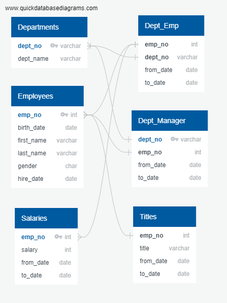

# Pewlett-Hackard Succession Planning Analysis

### Overview
A major employer has decided to modernize their employee records, moving from spreadsheets to a relational database.  It is expected that this transition will enable better visibility into the employee population and allow succession planning around the retirement of older employees.  An analysis will be performed to determine the feasibility of implementing a mentorship program.  This program will team up the older and selected younger workers to transfer knowledge from the older employees and build the skills of younger employees as they prepare to move up the company ranks.

## Input Analysis
The analysis consisted of a review of the six comma-separated-value (CSV) files that the company has provided as input into the new database.  The review revealed that the majority of the files contain several thousands of entries and each includes data headers.

### CSV Input Files
The following files were provided for input:

* departments.csv - provides department names and an identification number for each department.
* dept_emp.csv -  identifies the employee numbers within each department number, with from & to dates.
* dept_manager.csv - identifies the department managers by employee number, with from & to dates.
* employees.csv - provides employee names, birthdates, gender, and their hire date with their employee number.
* salaries.csv - provides the employee salary with employee number and from & to dates.
* titles.csv - identifies the employee titles, by employee number with from & to dates.

### Entity Relationship Diagram
Using the CSV input files, an Entity Relationship Diagram was constructed to begin planning the database implementation. 




THe company selected the PostgreSQL database engine for their new system. Using PGAdmin4, a new database was created and the data tables were then built in accordance with the Entity Relationship Diagram.

As the CSV files were being imported, it was discovered that there were two tables that needed to be dropped and rebuilt without primary keys.  The data in the CSV files contained many instances of multiple entries within the data destined to be the primary key for the tables.  The diagram above was updated to its current state to reflect the table structure, as implemented.

# Results

It was necessary to query and build new tables to explore the accumulated data, and begin to provide answers to the questions from management.

The following queries were created:

* Collect the retirement-eligible employee information into a single table
	* The following query was written to perform this task and store the results into a new ```emp_info``` table.
```
-- Employee list 1
select e.emp_no, e.first_name, e.last_name, e.gender, s.salary, de.to_date
	into emp_info
	from employees as e
	inner join salaries as s
		on (e.emp_no = s.emp_no)
	inner join dept_emp as de
		on (e.emp_no = de.emp_no)
	where (e.birth_date between '1952-01-01' and '1955-12-31')
	and (e.hire_date between '1985-01-01' and '1988-12-31')
	and (de.to_date = '9999-01-01');
```
	* This query returned a list of 33118 retirement-eligible current employees.
	
* Determine the number of retirement-eligible managers per department
	* The following query was written to perform this task and store the results into a new ```manager_info``` table.
```
-- List (2) of managers per department
select dm.dept_no,
	d.dept_name,
	dm.emp_no,
	ce.last_name,
	ce.first_name,
	dm.from_date,
	dm.to_date
into manager_info
from dept_manager as dm
	inner join departments as d
		on (dm.dept_no = d.dept_no)
	inner join current_emp as ce
		on (dm.emp_no = ce.emp_no);
```
	* This query returned a list of 5 retiring managers, but only two are current employees, as seen in the results below.
	


* Determine the number of retiring employees by title
	* The following query was written to provide the number of roles that will be vacated by retiring employees.
```
-- Identify the number of retiring employees by title
select count(title), title
into retiring_titles
from unique_titles
group by title
order by count(title) desc;
```
	* The query results provide a breakdown of the 33118 roles by title.
	


	* The number of expected vacancies within the Senior Engineer and Senior Staff roles is much more apparent within a simple bar chart.


	
* Determine the employees available to participate in a mentorship program
	* The following query was written to provide the number of employees eligible to participate in a mentorship program.
```
--Identify the employees eligible for participation in a mentorship program
select distinct on (e.emp_no) e.emp_no, e.first_name, e.last_name, e.birth_date,
	de.from_date, de.to_date, t.title
into mentorship_eligibility
from employees as e
join dept_emp as de
	on (e.emp_no = de.emp_no)
join titles as t
	on (e.emp_no = t.emp_no)
where (de.to_date = '9999-01-01') and
	(e.birth_date between '1965-01-01' and '1965-12-31')
order by e.emp_no;
```
	* The query results were as follows:


	* The majority of the eligible employees are in the Staff and Senior Engineer roles.


The analysis should contain the following:

    Overview of the analysis: Explain the purpose of this analysis.
    Results: Provide a bulleted list with four major points from the two analysis deliverables. Use images as support where needed.
    Summary: Provide high-level responses to the following questions, then provide two additional queries or tables that may provide more insight into the upcoming "silver tsunami."
        How many roles will need to be filled as the "silver tsunami" begins to make an impact?
        Are there enough qualified, retirement-ready employees in the departments to mentor the next generation of Pewlett Hackard employees?

